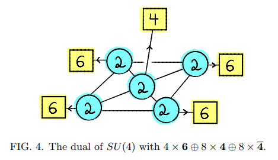
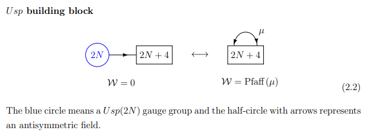
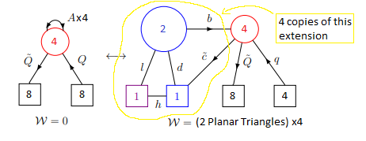

# Deconfinement

Okay so the theory in the Razamat paper is given by this figure:

The quiver is the dual theory of an SU(4) with 4 antisymmetric, 8 fundamentals, and 8 antifundamentals. The move I think I saw you doing was this one:

but then the issue is that the new Usp gauge group will be in this case rank 0. The deconfinement paper has another move which starts with a theory that is similar to the theory in the Razamat paper. It is given by:

so naively I just applied the move 4 times since we have 4 antisymmetric fields and got:

----
## References ##
[[1] Deconfinement](https://arxiv.org/pdf/2201.11049.pdf)

[[2] Razamat Duality](https://arxiv.org/pdf/1906.05088.pdf)
